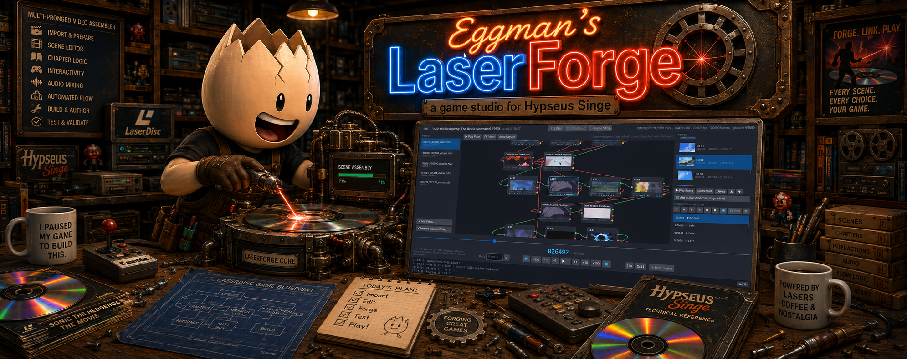

# Eggman's LaserForge

**A game studio for Hypseus Singe.** Build a playable laserdisc game — mark
your video scenes, storyboard the game's flow, choreograph the player's moves,
and export a complete, ready-to-run game — **without ever hand-editing a LUA
script or juggling frame numbers by hand.**

This guide is written for someone who is **new to both Windows game tools and
Hypseus Singe**. If a section already makes sense to you, skip ahead using the
table of contents.

---

## Table of contents

1. [What is this, in plain English?](#1-what-is-this-in-plain-english)
2. [What you'll need before you start](#2-what-youll-need-before-you-start)
3. [Installing and running the app](#3-installing-and-running-the-app)
4. [The one big idea: frames](#4-the-one-big-idea-frames)
5. [Your first project, step by step](#5-your-first-project-step-by-step)
6. [A tour of the workspace](#6-a-tour-of-the-workspace)
7. [Marking scenes](#7-marking-scenes)
8. [Adding player moves](#8-adding-player-moves)
9. [The Storyboard: wiring the game together](#9-the-storyboard-wiring-the-game-together)
10. [Game Setup: everything around the gameplay](#10-game-setup-everything-around-the-gameplay)
11. [Frameworks explained](#11-frameworks-explained)
12. [Exporting your game](#12-exporting-your-game)
13. [Testing in Hypseus](#13-testing-in-hypseus)
14. [Saving, opening, and importing](#14-saving-opening-and-importing)
15. [Keyboard shortcuts](#15-keyboard-shortcuts)
16. [Troubleshooting](#16-troubleshooting)
17. [License and credits](#17-license-and-credits)

---

## 1. What is this, in plain English?

**Hypseus Singe** is a free emulator that plays *laserdisc games* — arcade
games like *Dragon's Lair* where the "graphics" are actually a pre-recorded
video, and the game is really a series of **quick-time events**: the video
plays, and at the right moment you push a direction or a button. Get it right
and the story continues; get it wrong and you see a death scene.

A **Singe game** is just a folder of files: your video, your audio, and a
`.singe` script (written in a language called LUA) that tells the emulator
*"play from frame 1200 to 1450, and if the player presses UP between frames
1300 and 1330, jump to frame 1600."*

Writing that script by hand is where the pain lives. Every jump, every death,
every player input is a **frame number**, and you have to find each one by
scrubbing through video and copying numbers into a text file. One wrong number
and the game breaks. Authors routinely spend *weeks* on this.

**Eggman's LaserForge does the frame-number bookkeeping for you.** You watch
your video, mark the interesting moments visually, wire them together on a
storyboard, and the app writes a correct `.singe` script for you. You never
type a frame number into a script, and you never open a text editor.

**Who is this for?** Anyone who wants to make a Hypseus Singe game — whether
you're converting an old animated film, building something original from
AI-generated video, or remaking a classic. No programming required.

---

## 2. What you'll need before you start

| You need | Details |
|---|---|
| **Windows 10 or 11, 64-bit** | The app is Windows-only for now. Nothing to install beyond the app itself (see below). |
| **Hypseus Singe** | The emulator that actually runs your game. It's a separate free download — the app links you to it and helps you point at it. **v2.12.1 (64-bit) is recommended.** |
| **Your video** | A single MPEG-2 video file with the extension **`.m2v`**. This is the picture track your game plays. (Converting other formats to `.m2v` is done with a tool like FFmpeg — outside this app.) |
| **Your audio** *(optional but normal)* | An **`.ogg`** audio file that matches your video, so you hear sound while play-testing and in the finished game. |

> **Why `.m2v` and not `.mp4`?** Laserdisc games need *frame-exact* seeking —
> landing on the precise picture the author intended. Hypseus does this on raw
> MPEG-2 video, so that's the format your game must use. LaserForge reads the
> exact same format the same way, so what you see is what the game shows.

You do **not** need the .NET runtime, Visual Studio, or any developer tools to
*use* the app. Those are only needed if you want to build it from source.

---

## 3. Installing and running the app

1. Go to the [**Releases** page](https://github.com/Eggmansworld/EggmansLaserForge/releases)
   and download the file named **`EggmansLaserForge-0.1.1-win-x64.zip`**.
2. **Right-click the downloaded ZIP → Extract All…** and pick a folder you can
   find again (for example `C:\LaserForge`). Don't run it from inside the ZIP.
3. Open the extracted folder and double-click **`Ldp.App.exe`**.

> **"Windows protected your PC" / SmartScreen warning.** Because this is a
> small independent app that isn't code-signed, Windows may show a blue
> warning the first time. Click **More info → Run anyway**. This is expected
> for indie software and only happens once.

The app is fully **self-contained and portable** — everything it needs is in
that folder. There's no installer, nothing is written to your system, and you
can delete the folder to remove it completely. To move it to another PC, just
copy the whole folder.

---

## 4. The one big idea: frames

Everything in a laserdisc game is measured in **frames** — the individual
still pictures that make up the video (there are 30 of them per second in a
typical NTSC video, so frame 900 is 30 seconds in).

Two things make LaserForge's frame counter special, and they're the reason the
app exists:

- **It's exact.** Frame 13,145 in the app is *provably* the same picture
  Hypseus shows for frame 13,145. The app's video engine is built from the
  emulator's own playbook, so there's no "off by one or two" drift.
- **It's global.** If you add several videos to one project, they share **one
  continuous frame number line.** Video 2 might start at frame 40,000. This
  mirrors exactly how Hypseus stacks multiple discs, so the numbers the app
  writes into your script are the numbers the emulator expects.

You'll see the big frame counter in the middle of the transport bar at all
times. **You read it; you rarely type it.** Marking a scene captures the
numbers for you.

---

## 5. Your first project, step by step

Choose **File → New Project…** and a two-step wizard appears.

**Step 1 — Point at your Hypseus Singe emulator.**
Your finished game has to live *inside* the emulator's `singe` folder so it can
find everything it needs. Click **Locate Hypseus folder…** and select the
folder that contains `hypseus.exe`. Don't have Hypseus yet? The wizard has a
direct download link — grab the **Windows 64-bit** build, extract it, then come
back and point at it.

**Step 2 — Name the game folder.**
Type a short name with **no spaces** (spaces become underscores automatically),
for example `Sonic_the_Hedgehog_1996`. This one name becomes the game's folder,
its `.singe` script file, and your project file. The wizard shows you exactly
where it will be created.

Click **Create Game Project**. The app makes the folder inside Hypseus's
`singe` directory and you're ready to work.

**Then: add your video.** In the left **VIDEOS** panel click **＋ Add Video…**
and choose your `.m2v` file. The first time, the app *indexes* the video
(builds its frame map) — you'll see a short progress bar. After that, seeking
is instant, and the index is cached so it's only done once per video.

---

## 6. A tour of the workspace

Across the top are three tabs that switch what fills the middle of the window:

- **🎬 Editor** — watch the video, mark scenes, and place player moves.
- **🗺 Storyboard** — wire your scenes together into the game's flow.
- **🎮 Game Setup** — everything *around* the gameplay: titles, menus,
  difficulty, scoring, languages, and the framework.

Around those, the layout stays constant:

- **Left — VIDEOS:** every video in the project. Add or remove them here.
- **Center — the viewer:** your video, with the **transport bar** beneath it.
- **Right — SCENES and INTERACTIONS:** your marked scenes (with thumbnails) on
  top, and the player moves for the selected scene below.
- **Bottom — status bar:** a one-line status message, with a **Log ▲** button
  that slides open a detailed log (useful when something goes wrong).

**The transport bar** (under the video) is your remote control:

- The large number is the **current frame**; the smaller number beside it is
  the total.
- The jog buttons step you around: **⏮  −100  −10  −1  ▶  +1  +10  +100  ⏭**.
- **Go to** lets you jump straight to a frame number if you ever need to.
- The **slider** and the little **marker strip** above it show where you are
  and where your scenes sit.
- Almost everything has a **keyboard shortcut** (see §15) — most authors work
  with the arrow keys and the letter keys, hands never leaving the keyboard.

---

## 7. Marking scenes

A **scene** (also called a clip) is a named stretch of video — "Level 2 intro,"
"the jump-the-canyon death," and so on. Scenes are the building blocks you'll
wire together later.

To mark one:

1. Jog to the first frame you want and press **I** (or click ** In**).
2. Jog to the last frame and press **O** (or click **Out **).
3. Press **Enter** (or click **＋ New Scene**). A small form appears with the
   frame range already filled in — just give the scene a **name** and an
   optional **description**, and confirm.

Your scene appears in the **SCENES** list on the right with a thumbnail. From
there you can:

- **▶ Play Scene** — watch just that scene (with matching audio).
- **Go to Start** — jump the viewer to its first frame.
- **▲ / ▼** — reorder scenes in the list.
- **Delete** — remove it.
- **🗺 Add to Storyboard** — drop it onto the storyboard (or just drag it
  there).

You can mark scenes across **multiple videos** in one project; they all live on
the same global frame line.

---

## 8. Adding player moves

A **move** (the app calls them *interactions*) is a moment where the player
must do something — press a direction, a button, or "skip." Select a scene
first, then use the **INTERACTIONS** buttons on the right, or the keyboard:

| Move | Button | Key |
|---|---|---|
| Up / Down / Left / Right | ↑ ↓ ← → | **U / D / L / R** |
| Action button 1 / 2 | 🅐 🅑 | **1 / 2** |
| Skip (any input skips a passage) | ⏭ | **S** |

Each move is placed **at the current frame**, so jog to the exact moment the
player should react, then press the key. The app gives each move a **timing
window** (how long the player has to hit it) and **validates the spacing**
between back-to-back moves so you don't create an impossible sequence.

A **skip** move is special: it covers a *range* rather than a single instant.
Place it, then jog to where the skippable passage ends and press **E** (or the
**⤵ End** button) to set its end frame.

During playback, the currently-active move flashes **big and yellow** over the
video, and the move list scrolls to follow along — so you can *watch* your
choreography and feel whether the timing is fair.

---

## 9. The Storyboard: wiring the game together

Open the **🗺 Storyboard** tab. This is a **node graph** — like the flowcharts
in tools such as ComfyUI. Each scene is a box; you draw wires between boxes to
say *"after this scene, go to that one."*

Every gameplay scene can branch three ways:

- **Success** — the player did the right thing; continue the story.
- **Death** — the player failed; play a death and (usually) retry.
- **Timeout** — the player did nothing in time.

Wire your scenes up to describe the whole game's flow. You can **double-click a
scene to play it** right there, and **right-click** any node for more options —
so you can test a single beat or follow a whole branch without leaving the app.

This visual flow is what turns a pile of scenes into an actual game, and it's
what the exporter reads to write the jumps and branches into your script.

---

## 10. Game Setup: everything around the gameplay

Open the **🎮 Game Setup** tab. A real game isn't just gameplay — it has a
title screen, attract-mode videos, menus, a "game over," high-score entry, and
so on. This tab is a tidy form for all of it. A counter at the top-right tracks
**how many required slots you've filled**.

The sections:

- **Game Info** — the internal game **name**, the **folder** name, the
  **author** (required), a **version**, a **date** in `YYYY-MM-DD` form
  (required), a **synopsis**, and free-form **author notes**. This is also
  where you pick the **framework** (see §11).
- **Attract & Title** — the title screen and the intro/attract videos that play
  when nobody's at the machine.
- **System Videos** — "continue?", "level clear," "get ready," "game over,"
  "new high score," rankings, and similar sequences the framework plays for you.
- **Menu & Still Frames** — single still pictures used for menus and screens.
- **Difficulty Select Frames** — the still pictures for Easy / Normal / Hard /
  Extreme.
- **Scoring** — point values and similar numbers. Leave a box blank to keep the
  framework's sensible default (shown as a hint).
- **Language Tracks** — name each audio language and its filename suffix (the
  primary track has an empty suffix → `main.ogg`; a Russian track with suffix
  `_russian` → `main_russian.ogg`).

Two kinds of slot, two ways to fill them:

- A **video slot** wants a whole scene: select a scene in the bin, then click
  **⟵ scene**.
- A **still slot** wants a single picture: jog the viewer to the exact frame,
  then click **⟵ frame**.

Any filled slot shows its value in amber; click it to jump the viewer to that
frame and check it. Anything still **required** shows in red until you fill it.

---

## 11. Frameworks explained

A **framework** is a bundle of shared LUA code that does the boring,
universal parts of *every* Singe game — drawing menus, counting lives, running
the attract loop, handling difficulty — so your script only has to describe
*your* game. Think of it as the game engine your script plugs into.

LaserForge offers three choices in Game Setup:

- **Framework (global)** *(default)* — the widely-used shared framework. It
  lives **once** in Hypseus's `singe` folder and is shared by every game that
  uses it. **The app bundles this and installs it for you** the first time you
  need it, so you don't have to hunt it down.
- **FrameworkKimmy (global)** — a variant of the above tuned for stacked,
  punishing move timing (very demanding games). Also bundled and auto-installed.
- **Structure (custom standalone)** — a self-contained copy of the framework
  that lives **inside your own game folder**. Choose this when you want to
  tweak the framework's code for your game *without* affecting any other game
  on the system. It's the "advanced, I want to customize" option.

For a first game, leave it on the default. You won't have to download or copy
anything — the app handles the global frameworks automatically.

---

## 12. Exporting your game

When your scenes, storyboard, and Game Setup are ready, choose **File → Export
.singe to Game Folder**. The app:

1. Generates the complete `.singe` LUA script from a **known-good template** —
   every framework hook and helper comment preserved, every frame number filled
   in from your work.
2. Writes the frame index file the game needs.
3. Drops the chosen global framework into place if it isn't already installed.

Everything lands in the game folder you named at the start, inside Hypseus's
`singe` directory. **You never edit the script by hand** — re-export any time
you make changes.

> **Note:** the app manages the *script and frame data*. Your actual **video
> (`.m2v`) and audio (`.ogg`)** are yours to place in the game folder — they're
> deliberately never bundled or committed anywhere, because they're large and
> usually copyrighted.

---

## 13. Testing in Hypseus

Choose **File → ▶ Test in Hypseus…**. Your script and frame file are written
out, and a dialog gives you everything to run it:

- **▶ Run Now** — launches the emulator straight into your game.
- **Copy Command** — copies the exact command line, if you'd rather run it
  yourself from the Hypseus folder.
- **Open Log Folder** / **Open hypseus.log** — jump to the emulator's log.

> **Important:** if something is wrong, **Hypseus closes instantly with no error
> message.** That's normal emulator behaviour, not a crash of this app. When it
> happens, open **hypseus.log** (button right there in the dialog) — the reason
> is almost always in the last few lines (a missing video file, a bad path,
> etc.).

---

## 14. Saving, opening, and importing

- **Save / Save As** (File menu) — your work is stored in a project file. The
  app also **autosaves** as you go; the top bar shows the autosave status.
- **Open Project** — reopen a saved project to keep working.
- **Import .singe Script** — already have a hand-written Singe game? Import its
  `.singe` file and LaserForge reads the scenes, moves, and setup back **into a
  visual project**, auto-building the storyboard so you can edit it here instead
  of in a text editor.

Your video, audio, and generated frame-index files are **not** part of the
project file — keep the originals safe yourself.

---

## 15. Keyboard shortcuts

Most authoring is faster from the keyboard:

| Keys | Action |
|---|---|
| **← / →** | Step back / forward 1 frame |
| **Shift + ← / →** | Step ±10 frames |
| **Ctrl + ← / →** | Step ±100 frames |
| **Space** | Play / pause |
| **I / O** | Mark In / Mark Out |
| **Enter** | Create a new scene from the current In/Out |
| **U / D / L / R** | Add an Up / Down / Left / Right move at the current frame |
| **1 / 2** | Add an action-button 1 / 2 move |
| **S** | Add a Skip move |
| **E** | Set the selected Skip's end to the current frame |
| **Ctrl + Z** | Undo |

---

## 16. Troubleshooting

**The app won't open / Windows shows a blue "protected your PC" box.**
Click **More info → Run anyway** — the app is unsigned indie software (see §3).
Make sure you **extracted** the ZIP rather than running from inside it.

**My video won't load, or looks wrong.**
It must be an **`.m2v` (MPEG-2 elementary stream)**. Other formats — even an
`.mp4` renamed to `.m2v` — won't index correctly. Convert to real `.m2v` first.

**All my videos must be the same frame rate.**
The app auto-detects the frame rate from your first video and requires the
others to match, because the game runs at one rate. Game Setup shows the
detected rate under **Movie FPS**.

**I clicked Test/Run and Hypseus vanished immediately.**
Expected when something's off — Hypseus exits silently on error. Open
**hypseus.log** from the Test dialog and read the last lines. Common causes: the
`.m2v` / `.ogg` isn't in the game folder, or you pointed at the wrong Hypseus
folder.

**A required slot is red in Game Setup.**
That slot still needs a value. Video slots need a scene selected then **⟵
scene**; still slots need the viewer parked on a frame then **⟵ frame**.

**Where did my game go?**
Inside the Hypseus `singe` folder, in the game folder you named in the New
Project wizard.

---

## 17. License and credits

Source code and documentation are **MIT-licensed**. The bundled Singe
frameworks, and any game video, audio, artwork, or scripts you author or
import, remain the property of their respective copyright holders. See
[`LICENSE`](LICENSE) and [`NOTICE`](NOTICE).

Hypseus Singe is an independent project by DirtBagXon and contributors —
download it from
[github.com/DirtBagXon/hypseus-singe](https://github.com/DirtBagXon/hypseus-singe).

If LaserForge saves you some of those weeks, you can
[**buy me a coffee** ☕](https://buymeacoffee.com/eggmansworld).

*Built by Eggman for the laserdisc game and Hypseus Singe community, and
pair-programmed with Claude (Anthropic).*
