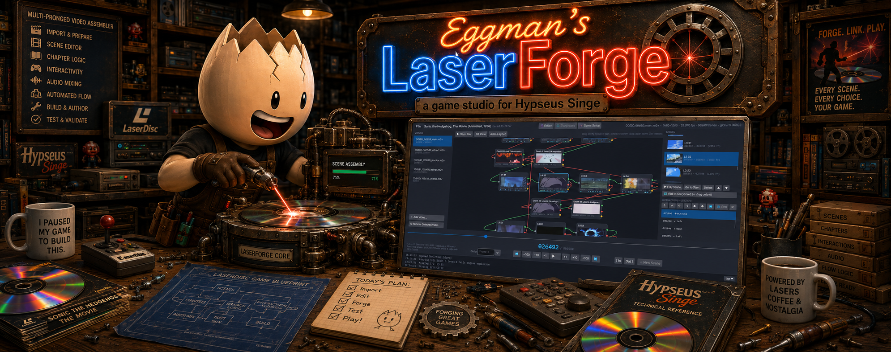

## A Note on AI-Assisted Development

This project was built with AI as a code design and development tool. That
means an AI model helped draft, structure, and troubleshoot portions of the
code — but every line went through a human (me) for review, testing, and final
approval. The AI proposes; I dispose. Nothing here shipped without my sign-off,
and I take responsibility for what's in the repository.

This disclaimer isn't here to sell you on AI-assisted coding or argue the point.
It's here so you know exactly how this project was made. If the use of AI in the
development process is a dealbreaker for you, that's a completely valid stance —
this just isn't the project for you. No hard feelings; feel free to move along.

---



# Eggman's LaserForge

**A game studio for Hypseus Singe.** Build a playable laserdisc game — mark
your video scenes, storyboard the game's flow, choreograph the player's moves,
and export a complete, ready-to-run game — **without ever hand-editing a LUA
script or juggling frame numbers by hand.**

This guide is written for someone who is **new to both Windows game tools and
Hypseus Singe**. If a section already makes sense to you, skip ahead using the
table of contents.

---

## Table of contents

1. [What is this, in plain English?](#1-what-is-this-in-plain-english)
2. [What you'll need before you start](#2-what-youll-need-before-you-start)
3. [Installing and running the app](#3-installing-and-running-the-app)
4. [The one big idea: frames](#4-the-one-big-idea-frames)
5. [Your first project, step by step](#5-your-first-project-step-by-step)
6. [A tour of the workspace](#6-a-tour-of-the-workspace)
7. [Marking scenes](#7-marking-scenes)
8. [Adding player moves](#8-adding-player-moves)
9. [The Storyboard: wiring the game together](#9-the-storyboard-wiring-the-game-together)
10. [Game Setup: everything around the gameplay](#10-game-setup-everything-around-the-gameplay)
11. [Frameworks explained](#11-frameworks-explained)
12. [Exporting your game](#12-exporting-your-game)
13. [Testing in Hypseus](#13-testing-in-hypseus)
14. [Saving, opening, and importing](#14-saving-opening-and-importing)
15. [Keyboard shortcuts](#15-keyboard-shortcuts)
16. [Troubleshooting](#16-troubleshooting)
17. [License and credits](#17-license-and-credits)

---

## 1. What is this, in plain English?

**Hypseus Singe** is a free emulator that plays *laserdisc games* — arcade
games like *Dragon's Lair* where the "graphics" are actually a pre-recorded
video, and the game is really a series of **quick-time events**: the video
plays, and at the right moment you push a direction or a button. Get it right
and the story continues; get it wrong and you see a death scene.

A **Singe game** is just a folder of files: your video, your audio, and a
`.singe` script (written in a language called LUA) that tells the emulator
*"play from frame 1200 to 1450, and if the player presses UP between frames
1300 and 1330, jump to frame 1600."*

Writing that script by hand is where the pain lives. Every jump, every death,
every player input is a **frame number**, and you have to find each one by
scrubbing through video and copying numbers into a text file. One wrong number
and the game breaks. Authors routinely spend *weeks* on this.

**Eggman's LaserForge does the frame-number bookkeeping for you.** You watch
your video, mark the interesting moments visually, wire them together on a
storyboard, and the app writes a correct `.singe` script for you. You never
type a frame number into a script, and you never open a text editor.

**Who is this for?** Anyone who wants to make a Hypseus Singe game — whether
you're converting an old animated film, building something original from
AI-generated video, or remaking a classic. No programming required.

---

## 2. What you'll need before you start

| You need | Details |
|---|---|
| **Windows 10 or 11, 64-bit**, 1680x1050 minimum resolution| The app is Windows-only for now. Nothing to install beyond the app itself (see below). Note the app resolution requirements - the app will not display properly on a low-resolution monitor. |
| **Hypseus Singe** | The emulator that actually runs your game. It's a separate free download — the app links you to it and helps you point at it. **Grab the latest Windows release (64-bit)** — both the current v3.x (SDL3) line and the older v2.12.1 work fine. Link at the bottom of this readme.|
| **Your video** | A minimum of one MPEG-2 video file with the extension **`.m2v`**. This is the picture track your game plays. (Converting other formats to `.m2v` is done with a tool like FFmpeg — **general remuxes can be done inside this app**, complex reencodes you will do on your own outside this app.) |
| **Your audio** *(optional but recommended)* | An **`.ogg`** audio file that matches your video (ideally generated at the same time your m2v is), so you hear sound while play-testing and in the finished game. |

> **Why `.m2v` and not `.mp4`?** Laserdisc games need *frame-exact* seeking —
> landing on the precise picture the author intended. Hypseus does this on raw
> MPEG-2 video, so that's the format your game must use. LaserForge reads the
> exact same format the same way, so what you see is what the game shows.

You do **not** need the .NET runtime, Visual Studio, or any developer tools to
*use* the app. Those are only needed if you want to build it from source.

---

## 3. Installing and running the app

1. Go to the [**Releases** page](https://github.com/Eggmansworld/EggmansLaserForge/releases)
   and download the latest release.
2. **Right-click the downloaded ZIP → Extract All…** and pick a folder you can
   find again (for example `C:\LaserForge`). Don't run it from inside the ZIP.
3. Open the extracted folder and double-click **`LaserForge.exe`**.

> **"Windows protected your PC" / SmartScreen warning.** Because this is a
> small independent app that isn't code-signed, Windows may show a blue
> warning the first time. Click **More info → Run anyway**. This is expected
> for indie software and only happens once.

The app is fully **self-contained and portable** — everything it needs is in
that folder. There's no installer, nothing is written to your system, and you
can delete the folder to remove it completely. To move it to another PC, just
copy the whole folder.

---

## 4. The one big idea: frames

Everything in a laserdisc game is measured in **frames** — the individual
still pictures that make up the video (there are 30 of them per second in a
typical NTSC video, so frame 900 is 30 seconds in).

Two things make LaserForge's frame counter special, and they're the reason the
app exists:

- **It's exact.** Frame 13,145 in the app is *provably* the same picture
  Hypseus shows for frame 13,145. The app's video engine is built from the
  emulator's own playbook, so there's no "off by one or two" drift.
- **It's global.** If you add several videos to one project, they share **one
  continuous frame number line.** Video 2 might start at frame 40,000. This
  mirrors exactly how Hypseus stacks multiple discs, so the numbers the app
  writes into your script are the numbers the emulator expects.

You'll see the big frame counter in the middle of the transport bar at all
times. **You read it; you rarely type it.** Marking a scene captures the
numbers for you.

---

## 5. Your first project, step by step

Open the app and and a wizard appears.

**Step 1 — Point at your Hypseus Singe emulator.**
Your finished game has to live *inside* the emulator's `singe` folder so it can
find everything it needs. Click **Locate Hypseus folder…** and select the
folder that contains `hypseus.exe`. Don't have Hypseus yet? The wizard has a
direct download link — grab the latest **Windows 64-bit** build, extract it, then
come back and point at it.

**Step 2 — Name the game folder.**
Type a short name with **no spaces** (spaces become underscores automatically),
for example `Sonic_the_Hedgehog_1996`. This name becomes the game's folder,
its `.singe` script file, and your project file. The wizard shows you exactly
where it will be created.

Click **Create Game Project**. The app makes the folder inside Hypseus's
`singe` directory and you're ready to work.

**Then: add your video.** It is recommended to put all .m2v and .ogg video files
you want to use inside your game's "Video" folder. In the left **VIDEOS** panel
click **＋ Add Video…** and choose your `.m2v` file. The first time, the app
*indexes* the video (builds its frame map) — you'll see a short progress bar.
After that, seeking is instant, and the index is cached so it's only done once
per video.

---

## 6. A tour of the workspace

Across the top are three tabs that switch what fills the middle of the window:

- **🎬 Editor** — watch the video, mark scenes, and place player moves.
- **🗺 Storyboard** — wire your scenes together into the game's flow.
- **🎮 Game Setup** — everything *around* the gameplay: titles, menus,
  difficulty, scoring, languages, and the framework.

Around those, the layout stays constant:

- **Left — VIDEOS:** every video in the project. Add or remove them here.
- **Center — the viewer:** your video, with the **transport bar** beneath it.
- **Right — SCENES and INTERACTIONS:** your marked scenes (with thumbnails) on
  top, and the player moves for the selected scene below.
- **Bottom — status bar:** a one-line status message, with a **Log ▲** button
  that slides open a detailed log drawer (useful when something goes wrong).

**The transport bar** (under the video) is your remote control:

- The large number is the **current frame**; the smaller number beside it is
  the total.
- The jog buttons step you around: **⏮  −100  −10  −1  ▶  +1  +10  +100  ⏭**.
- **Go to** lets you jump straight to a frame number if you ever need to.
- Beside it, a small **hh:mm:ss** clock shows roughly how far into the video
  you are. It follows every way of moving — buttons, keys, slider, playback —
  and is there purely to orient you. Frames remain the unit the app works in;
  the clock is rounded to the second and never feeds back into a frame number.
- The **slider** moves you through the video, and the **timeline strip** above
  it shows the whole video at once (see below).
- Almost everything has a **keyboard shortcut** (see §15) — most authors work
  with the arrow keys and the letter keys, hands never leaving the keyboard.

### The timeline strip

The band above the slider is the **entire video, end to end**, colour-coded by
what each stretch is for. It is always full, so you can see the shape of your
whole game without scrolling or clicking anything.

| Colour | What it is |
|---|---|
| 🟦 **Blue** | A gameplay scene — footage a level plays |
| 🟦 **Dark blue** | A level's intro clip |
| 🟥 **Red** | A death scene |
| 🟪 **Violet** | A framework video slot (attract, title, Game Over…) |
| ▫️ **Pale violet** | A single-frame still slot (menus, trophy, difficulty cards) |
| ⬜ **Dashed outline** | A scene you marked that **nothing references** — no level plays it, no move dies to it, no slot holds it |
| ⬛ **Dark / empty** | **Unused video.** No part of the game touches these frames |

Above it, a thin band groups scenes into **levels**, numbered and named where
there's room. Below it, **amber ticks** are player moves — the selected scene's
moves stand full height, every other move in the video is a shorter stub, so
you can see how busy the game is without losing the scene you're editing. A
move that breaks the spacing rules turns red.

The line above the strip names whatever the **playhead** is over — level, scene,
death, slot, or "unused video" with the length of the run — and the figure on
the right is **how much of the video the game actually plays**.

**Click or drag anywhere on the strip to jump there**, and hover for the same
description as a tooltip.

> **Why the empty space matters.** The dark runs are footage your game never
> shows. A long one late in a project is worth a look: it may be a scene you
> meant to mark and forgot. When you're finished, it's also a measure of how
> much of the file is dead weight — a feature film cut down to a game routinely
> leaves most of itself unused.

---

## 7. Marking scenes

A **scene** (also called a clip) is a named piece of video — "Level 2 intro,"
"the jump-the-canyon death," and so on. Scenes are the building blocks you'll
wire together later.

To mark one:

1. Jog to the first frame you want and press **I** (or click **⟦ In**).
2. Jog to the last frame and press **O** (or click **Out ⟧**).
3. Press **Enter** (or click **＋ New Scene**). A small form appears with the
   frame range already filled in — just give the scene a **name** and an
   optional **description**, and confirm.

Your scene appears in the **SCENES** list on the right with a thumbnail. From
there you can:

- **▶ Play Scene** — watch just that scene (with matching audio).
- **Go to Start** — jump the viewer to its first frame.
- **▲ / ▼** — reorder scenes in the list.
- **Delete** — remove it.
- **🗺 Add to Storyboard** — drop it onto the storyboard (or just drag it
  there).

You can mark scenes across **multiple videos** in one project; they all live on
the same global frame line.

---

## 8. Adding player moves

A **move** (the app calls them *interactions*) is a moment where the player
must do something — press a direction, a button, or "skip." Select a scene
first, then use the **INTERACTIONS** buttons on the right, or the keyboard:

| Move | Button | Key |
|---|---|---|
| Up / Down / Left / Right | ↑ ↓ ← → | **W / S / A / D** |
| Action button 1 / 2 | 🅐 🅑 | **Q / E** |
| Skip Start (any input skips a passage) | ⏭ | **Z** |
| Skip End (if not end of scene, frame to end on) | ⤵ | **C** |

Each move is placed **at the current frame**, so jog to the exact moment the
player should react, then press the key. The app gives each move a **timing
window** (how long the player has to hit it) and **validates the spacing**
between back-to-back moves so you don't create an impossible sequence.

A **skip** move is special: it covers a *range* rather than a single instant.
Place it, then jog to where the skippable passage ends and press **E** (or the
**⤵ End** button) to set its end frame.

### Two-input and hold moves

The **＋ Two-input & hold moves…** picker underneath those buttons adds the
moves that take more than one input:

| Move | Player does |
|---|---|
| **Up + Left**, Up + Right, Down + Left, Down + Right | Holds two directions together |
| **Button 1 + Up / Down / Left / Right** | Holds the action button and a direction together |
| **Hold Up / Down / Left / Right / Button 1** | Holds an input, then releases it on cue |

These are on a picker rather than the keyboard on purpose — the six above are
the ones worth muscle memory, and a key for every combination would crowd them
out. **None of them needs a gamepad.** A diagonal is simply two direction keys
pressed at the same time; the framework tests them as two separate inputs being
held at once.

Choosing a **Hold** adds *two* moves — the hold and a **Let go** after it —
because the game engine reads the move following a hold as its release. Jog the
Let go to wherever the player should let go. If a hold ever ends up without one,
exporting tells you which scene and frame.

Some community scripts use move types this app can't author yet — mash rates
like `MASHMAX`, and branch constructs like `PATH`, `TIMED` and `CHOOSE`.
**Importing a game keeps them exactly as written** and exports them unchanged,
so nothing is lost; they simply appear in the move list under their script name
and can't be edited here.

A branch move is really *two* lines in the script — the move itself, and a
second row saying what each answer does:

```lua
move[1] = {7356, 7500, PATH, -1}          -- a decision happens here
path[1] = {BUTTON1,1039,0,0,0,0,0,0,2}    -- and this is the decision
```

Both are kept, and the second row travels **with its move** — so if you add or
delete moves around it, it's renumbered to match instead of quietly coming to
describe a different one. Exporting warns you if a branch move ever loses its
row, because the game engine clears that table for every scene and would fail
on the move rather than skip it.

During playback, the currently-active move flashes **big and yellow** over the
video, and the move list scrolls to follow along — so you can *watch* your
choreography and feel whether the timing is fair.

---

## 9. The Storyboard: wiring the game together

Open the **🗺 Storyboard** tab. This is a **node graph** — like the flowcharts
in tools such as ComfyUI. Each scene is a box; you draw wires between boxes to
say *"after this scene, go to that one."*

Every gameplay scene branches two ways:

- **Success** — the player did the right thing; continue the story.
- **Death** — the player failed; play a death and (usually) retry.

Wire your scenes up to describe the whole game's flow. You can **double-click a
scene to play it** right there, and **right-click** any node for more options —
so you can test a single beat or follow a whole branch without leaving the app.

This visual flow is what turns a pile of scenes into an actual game, and it's
what the exporter reads to write the jumps and branches into your script.

---

## 10. Game Setup: everything around the gameplay

Open the **🎮 Game Setup** tab. A real game isn't just gameplay — it has a
title screen, attract-mode videos, menus, a "game over," high-score entry, and
so on. This tab is a tidy form for all of it. A counter at the top-right tracks
**how many required slots you've filled**.

The sections:

- **Game Info** — the internal game **name**, the **folder** name, the
  **author** (required), a **version**, a **date** in `YYYY-MM-DD` form
  (required), a **synopsis**, and free-form **author notes**. This is also
  where you pick the **framework** (see §11).
- **Attract & Title** — the title screen and the intro/attract videos that play
  when nobody's at the machine.
- **System Videos** — "continue?", "level clear," "get ready," "game over,"
  "new high score," rankings, and similar sequences the framework plays for you.
- **Menu & Still Frames** — single still pictures used for menus and screens.
- **Difficulty Select Frames** — the still pictures for Easy / Normal / Hard /
  Extreme.
- **Scoring** — point values and similar numbers. Leave a box blank to keep the
  framework's sensible default (shown as a hint).
- **Language Tracks** — name each audio language and its filename suffix (the
  primary track has an empty suffix → `main.ogg`; a Russian track with suffix
  `_russian` → `main_russian.ogg`).

### Finding scenes

The **SCENES** list has a **Find** box, a sort selector, and quick filter chips
— **No level**, **No moves**, **Deaths** — for the states that actually cause
export problems. The header shows how many are hidden ("38 of 74 shown"), and
your filter, sort and search text are remembered next time you open the app.

Sorting changes only what *you* see. The play order the script uses comes from
the project's own scene order, so re-sorting the list can never change what the
exported game does. (Hand reordering with ▲▼ is only available in **Project
order**, where moving a row actually shows.)

Two kinds of slot, two ways to fill them:

- A **video slot** wants a whole scene: select a scene in the bin, then click
  **⟵ scene**.
- A **still slot** wants a single picture: jog the viewer to the exact frame,
  then click **⟵ frame**.

Any filled slot shows its value in amber; click it to jump the viewer to that
frame and check it. Anything still **required** shows in red until you fill it.

Every filled slot also shows a small **preview picture**, so you can see at a
glance what each one actually is instead of reading frame numbers. Empty slots
stay on a single compact line. For a video slot, the picture is the scene's
thumbnail — click the little **📷** on it to use whatever frame the viewer is
currently showing instead (handy when a scene opens on a black fade). For a
still slot the picture simply *is* that frame.

### Turning artwork into a slot

Singe has no way to display an image file — every menu background, instructions
page and difficulty screen is a **frame number on the disc**. So a picture has
to become video first.

**Tools → 🖼 Still Image → M2V…** does that for you: point it at a PNG and it
writes a short `.m2v` passage, matched automatically to your project's picture
size and frame rate, into your game's `Video` folder. You can set the length,
add a fade in/out, and optionally drop the result straight into a slot — it is
added as a project video with its own scene, ready to use.

---

## 11. Frameworks explained

A **framework** is a bundle of shared LUA code that does the boring,
universal parts of *every* Singe game — drawing menus, counting lives, running
the attract loop, handling difficulty — so your script only has to describe
*your* game. Think of it as the game engine your script plugs into.

LaserForge offers three choices in Game Setup:

- **Framework (global)** *(default)* — the widely-used shared framework. It
  lives **once** in Hypseus's `singe` folder and is shared by every game that
  uses it. **The app bundles this and installs it for you** the first time you
  need it, so you don't have to hunt it down.
- **FrameworkKimmy (global)** — a variant of the above tuned for stacked,
  punishing move timing (very demanding games). Also bundled and auto-installed.
- **Structure (custom standalone)** — a self-contained copy of the framework
  that lives **inside your own game folder**. Choose this when you want to
  tweak the framework's code for your game *without* affecting any other game
  on the system. It's the "advanced, I want to customize" option.

For a first game, leave it on the default. You won't have to download or copy
anything — the app handles the global frameworks automatically.

---

## 12. Exporting your game

When your scenes, storyboard, and Game Setup are ready, choose **File → Export
.singe to Game Folder**. The app:

1. Generates the complete `.singe` LUA script from a **known-good template** —
   every framework hook and helper comment preserved, every frame number filled
   in from your work.
2. Writes the frame index file the game needs.
3. Drops the chosen global framework into place if it isn't already installed.

Everything lands in the game folder you named at the start, inside Hypseus's
`singe` directory. **You never edit the script by hand** — re-export any time
you make changes.

> **Note:** the app manages the *script and frame data*. Your actual **video
> (`.m2v`) and audio (`.ogg`)** are yours to place in the game folder — they're
> deliberately never bundled or committed anywhere, because they're large and
> usually copyrighted.

---

## 13. Testing in Hypseus

Choose **File → ▶ Test in Hypseus…**. Your script and frame file are written
out, and a dialog gives you everything to run it:

- **▶ Run Now** — launches the emulator straight into your game.
- **Copy Command** — copies the exact command line, if you'd rather run it
  yourself from the Hypseus folder.
- **Open Log Folder** / **Open hypseus.log** — jump to the emulator's log.

> **Important:** if something is wrong, **Hypseus closes instantly with no error
> message.** That's normal emulator behaviour, not a crash of this app. When it
> happens, open **hypseus.log** (button right there in the dialog) — the reason
> is almost always in the last few lines (a missing video file, a bad path,
> etc.).

---

## 14. Saving, opening, and importing

- **Save / Save As** (File menu) — your work is stored in a project file. The
  app also **autosaves** as you go; the top bar shows the autosave status.
- **Open Project** — reopen a saved project to keep working.
- **Import .singe Script** — already have a hand-written Singe game? Import its
  `.singe` file and LaserForge reads the scenes, moves, and setup back **into a
  visual project**, auto-building the storyboard so you can edit it here instead
  of in a text editor.

> **Importing replaces, it doesn't merge.** The levels, scenes, moves, deaths
> and slots are rebuilt from the script every time, so you can re-import the
> same file freely — to pick up a correction, or after editing the script
> outside the app — without the game doubling up. Your **videos are kept**;
> they belong to the project, not the script. The app asks first when there's
> something to replace, and **Ctrl+Z** undoes the whole import.

> **Relative frames are converted to real ones.** Some scripts set
> `RelativeFrames = true`, which means every `sceneStart`, `sceneEnd` and move
> frame in them is counted **from the start of its own level** rather than from
> the start of the disc — Tron's `move[1] = {271, 286, UP, 23}` is really frame
> 10020, because Level 1 begins at 9749. LaserForge folds that base in on import,
> so what you see in the editor is the frame you see on the video, and the script
> it exports sets `RelativeFrames = false` to match. Nothing else moves: the
> `Death[]` table, the `Level[]` lines and the menu slots are already real frame
> numbers under both settings.

Your video, audio, and generated frame-index files are **not** part of the
project file — keep the originals safe yourself.

### Reworking a video you already have

Two repairs live in the **Tools** menu for videos that are *nearly* right.

**Tools → ⬛ Black Out Frames…** paints a span of a video black without moving a
single frame. This is for imported games: authors sometimes cut the whole film
into out-of-order pieces and append the deaths, still frames and system videos
at the end. Once you have the film as its own clean video, the film half of the
original is dead weight — but its **frame numbers are not**, because every death
and still slot in the imported script points into that same file. Blacking those
frames out keeps every number exactly where it is and drops most of the bytes
(around 85% of the blanked span). Both ends of the span are **included**, and the
numbers are the ones on the app's own frame counter. This feature was created for
use in the reimagined "Altered Carbon: Resleeved" game.

Before the app will use the result it re-reads it and checks the frame count
matches the original **exactly**. If it doesn't, the file is left on disk and
nothing is swapped — a frame gained or lost would move every scene, move, death
and slot at once. The original file is kept, and **Ctrl+Z** undoes the swap.

**Tools → ⏩ Change Frame Rate…** re-times a clip that arrived at the wrong rate.
Every video in a game has to share one frame rate, because all move timing is
counted in frames, so a 25 fps clip can't join a 29.97 fps project until it's
converted. The target is preselected to your project's rate, and the frame count
before and after is shown before you run it. This is a real re-timing, not a
relabel — frames are added or dropped so the clip plays at the right speed —
which is why it's meant for a clip you have **not** added to the project yet. This
is perfect for extra videos you may want to add to your game, such as movie or TV
trailers you download from other sources that may have a different frame rate.

### HDR sources

A 4K HDR master (HEVC HDR10 or HLG) does not hold picture the way an `.m2v`
does. Its brightness sits on the **PQ** curve, built for displays ten times
brighter than SDR, and its colours are measured against the much wider
**BT.2020** triangle. MPEG-2 has neither, and Hypseus plays plain 8-bit BT.709.

Encoded straight across, every number in the file survives and every number
*means* something different — ordinary picture content lands high on a curve
that then gets read as normal gamma, and BT.2020 colours read as BT.709 collapse
toward grey. The result is a video that looks washed out, milky and almost
colourless, which is exactly what it is.

**Convert Video to M2V** now spots this on the probe and pre-ticks **Convert
HDR to SDR** for that file, tone-mapping the picture properly on the way in and
tagging the result BT.709 so nothing downstream tries to "fix" it again. The
resize happens inside the conversion, while the picture is still in linear light
and full precision, rather than after. You can untick it per file, and the exact
FFmpeg command is shown as always. Sources that are already BT.709 are untouched
and the option doesn't appear for them.

---

## 15. Keyboard shortcuts

Most authoring is faster from the keyboard:

| Keys | Action |
|---|---|
| **← / →** | Step back / forward 1 frame |
| **Shift + ← / →** | Step ±10 frames |
| **Ctrl + ← / →** | Step ±100 frames |
| **Space** | Play / pause |
| **I / O** | Mark In / Mark Out |
| **Enter** | Create a new scene from the current In/Out |
| **W / A / S / D** | Add an Up / Left / Down / Right move at the current frame |
| **Q / E** | Add an action-button 1 / 2 move (**1 / 2** also work) |
| **Z** | Start a Skip move |
| **C** | Set the selected Skip's end to the current frame |
| **G** | Jump to the "go to frame" box |
| **Ctrl + Z** | Undo |

Adding moves is the most repeated thing you'll do, so those keys sit under a
hand resting on the left home row — the same **WASD** shape most games use.

---

## 16. Troubleshooting

**The app won't open / Windows shows a blue "protected your PC" box.**
Click **More info → Run anyway** — the app is unsigned indie software (see §3).
Make sure you **extracted** the ZIP rather than running from inside it.

**My video won't load, or looks wrong.**
It must be an **`.m2v` (MPEG-2 elementary stream)**. Other formats — even an
`.mp4` renamed to `.m2v` — won't index correctly. Convert to real `.m2v` first.

**All my videos must be the same frame rate.**
The app auto-detects the frame rate from your first video and requires the
others to match, because the game runs at one rate. Game Setup shows the
detected rate under **Movie FPS**.

**I clicked Test/Run and Hypseus vanished immediately.**
Expected when something's off — Hypseus exits silently on error. Open
**hypseus.log** from the Test dialog and read the last lines. Common causes: the
`.m2v` / `.ogg` isn't in the game folder, or you pointed at the wrong Hypseus
folder.

**A required slot is red in Game Setup.**
That slot still needs a value. Video slots need a scene selected then **⟵
scene**; still slots need the viewer parked on a frame then **⟵ frame**.

**Where did my game go?**
Inside the Hypseus `singe` folder, in the game folder you named in the New
Project wizard.

---

## 17. License and credits

Source code and documentation are **MIT-licensed**. The bundled Singe
frameworks, and any game video, audio, artwork, or scripts you author or
import, remain the property of their respective copyright holders. See
[`LICENSE`](LICENSE) and [`NOTICE`](NOTICE).

Hypseus Singe is an independent project by DirtBagXon and contributors —
download it from
[github.com/DirtBagXon/hypseus-singe](https://github.com/DirtBagXon/hypseus-singe).

If LaserForge saves you some of those weeks, you can
[**buy me a coffee** ☕](https://buymeacoffee.com/eggmansworld).

*Built by Eggman for the laserdisc game and Hypseus Singe community, and
pair-programmed with Claude (Anthropic).*
